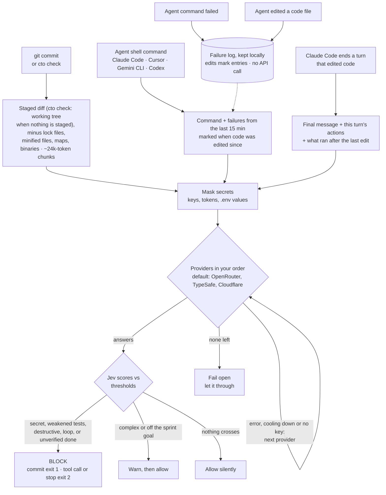

# your-cto-jev

**A sharp-tongued CTO that reviews what your AI coding agent is about to do, and says no.**

`cto` hooks into `git commit` and into Claude Code, Cursor, Gemini CLI and Codex. Before a commit lands, before an agent runs a shell command, and when Claude Code says it is done, it asks [TypeSafe Jev](https://developers.cloudflare.com/ai/models/typesafe/jev/), a typed decision model, a few yes/no questions. Then it blocks, warns, or stays completely silent.

```text
$ git commit -m "add payments"
[cto] Nice one, genius. You almost pushed a secret into Git. Commit BLOCKED. Remove it.
      credential_leak = 0.94 (threshold > 0.5)

# Claude Code tries: rm -rf ~
[cto] Hold it. This command is irreversibly destructive. Not running it.
      destructive_command = 0.96 (threshold > 0.7)

# Same build fails twice, agent tries the exact same thing again
[cto] Same error again. You are looping and burning tokens. This tool call is BLOCKED. Fix the logic first.
      infinite_loop = 0.95 (threshold > 0.6)
```

Messages come in English or 繁體中文, picked from your locale.

## Why

Coding agents move fast and occasionally do something you would never approve: commit an API key, `rm -rf` the wrong directory, force-push over a shared branch, or retry the same failing command until your token budget is gone. Regex scanners catch some of this, but they cannot tell a real key from a placeholder, or a cleanup from a disaster.

Jev judges meaning and answers with probabilities, not prose. It costs about $0.00002 per check and answered in about 250 ms (p95 about 330 ms) in our tests. `cto` adds the hooks, the thresholds and the attitude.

## What it checks

| Signal | Where | What happens |
|---|---|---|
| `credential_leak` | every `git commit` | **Blocks** the commit |
| `test_tampering` | `git commit`s that touch tests or test config | **Blocks** the commit |
| `destructive_command` | every agent shell command | **Blocks** the command |
| `infinite_loop` | agent shell commands, after a recent failure | **Blocks** the command |
| `done_unverified` | Claude Code ending a turn that edited code | **Sends it back to work** until the change is verified or the gap is disclosed |
| `architecture_violation` | `git commit`, once you set a sprint goal | Warns only |
| `code_complexity` | every `git commit` | Warns only |

`test_tampering` catches the classic agent shortcut: making a red test green by skipping it, deleting its assertions, loosening the expectation, or lowering the coverage bar, instead of fixing the code. It lets through real fixes, new or tighter tests, refactors, and tests removed together with their feature.

`done_unverified` catches the other classic shortcut: "Done, all tests pass!" when nothing ran after the last edit, the last run failed, or the claim is not backed by anything the agent actually did. It lets through turns that ran a passing check after the last edit, turns that changed only docs or CI config, and turns where the agent honestly says what it could not verify. It blocks at most once per stop, so it cannot loop.

Architecture and complexity only warn on purpose. They are subjective, and a gate that blocks too often teaches people to use `git commit --no-verify`, which switches off the secret check too.

When nothing crosses a threshold, `cto` prints nothing at all.

## How it works



A provider that fails is skipped for 5 minutes after a timeout, `429` or `5xx`, or for 1 hour after an auth or billing error, then retried. A `400` means the request itself is wrong, so `cto` fails open without trying the other provider.

## Quick start

Requires Node.js 22 or newer.

```sh
npm install -g your-cto-jev
cd your-project
cto setup
```

To update later, run `cto update`. Projects you already set up pick up the new version automatically: every hook only calls `cto`, and all the logic lives in the package. `cto` checks npm for a new version at most once a day and mentions it in its once-per-session notice, never on its own.

`cto setup` walks you through four steps with arrow keys: coding agents, Jev providers, API keys, and an optional sprint goal. Esc goes back a step. Providers are ticked in priority order, so the numbers you see are the failover order. Press a number to move the item under the cursor straight to that position:

```text
◆  Which Jev providers should cto use?
│  › [1] OpenRouter   easiest, one key (openrouter.ai)
│    [ ] TypeSafe     direct from the makers of Jev, one key
│    [2] Cloudflare   Account ID + API token; needs Authenticated Gateway and credits
│  Up/Down move · Space toggles · a number moves the item to that position · Enter confirms · Esc goes back
```

Each key is verified with one real request before it is saved. Keys you already stored are shown only by their last four characters, so you can keep them without pasting again.

Run `cto setup` again any time: it opens an overview of your current setup, and you can change one item without touching the rest. Changing only the order asks for nothing else; keys are asked only for newly added providers, and **Change API keys** in the overview replaces stored ones.

Then restart your agent session so it picks up the new hooks, and check that everything really works:

```sh
cto doctor
```

`cto doctor` sends one real request per provider, shows where each key comes from, checks the hooks in the current repo, shows when the last check ran, and counts how often a check was blocked or let through unchecked. It exits non-zero when something needs attention. Run it whenever you are unsure whether `cto` is protecting you: because `cto` fails open, a broken key looks exactly like a clean pass.

Other forms:

```sh
cto setup --agents claude,cursor --yes   # non-interactive (scripts, CI); only adds, never removes
cto setup --refresh                      # re-write hooks and rules for the agents already set up
cto setup --uninstall                    # remove every cto hook, rules block and skill again
cto doctor                               # is it actually working?
cto check                                # preview the commit checks on your current changes
```

`setup` appends marked blocks and merges JSON. It never overwrites your existing hooks or settings, and `--uninstall` puts them back exactly as they were. It never touches your shell rc files.

## The rules, written down for the agent

`cto setup` also writes the development rules of the repo for coding agents, where every rule names the check that enforces it. Agents read them before they work, so they get blocked less, and when they are blocked they know why and how to fix it.

The rules go where agents always look: a short marked block appended to `CLAUDE.md` (Claude Code), `AGENTS.md` (Codex, Cursor) and `GEMINI.md` (Gemini CLI), only for the agents you picked. Your own content in those files is left alone, and uninstall takes out exactly the block. The details, including what each check looks for and how to handle a block, live in one skill at `.agents/skills/cto/SKILL.md`; the rules block points every agent there.

| Rule | Enforced by |
|---|---|
| Secrets stay out of code | `credential_leak` blocks the commit |
| Fix the code, not the tests | `test_tampering` blocks the commit |
| Done means verified | `done_unverified` sends the agent back to work |
| Two strikes, change approach | `infinite_loop` blocks the retry once |
| Ask before anything irreversible | `destructive_command` blocks the command |
| Stay on the sprint goal | `architecture_violation` warns |
| Keep it simple | `code_complexity` warns |

The rules also tell the agent to run `cto check` before committing, and never to bypass a block with `--no-verify` or by editing thresholds. Commit these files so the whole team's agents follow the same rules. `cto update` refreshes them (and any new hooks) in the repo you run it from; `cto doctor` flags a repo whose rules or hooks are older than the installed version, and `cto setup --refresh` brings it up to date.

`cto check` runs the commit checks on your staged changes (or, if nothing is staged, on every working-tree change including new files) without committing, and prints each score next to its threshold:

```text
[cto] Nothing staged, checking the working tree instead (9 files, including new untracked files):
  credential_leak         0.03   blocks above 0.5  ok
  test_tampering          0.03   blocks above 0.8  ok
  architecture_violation  not checked: sprint_goal is empty in .cto.json
  code_complexity         2.02   warns above 2  would warn
[cto] Good to commit.
```

## Supported agents

The git pre-commit check is always installed. It protects every agent and every human who commits from that repo.

| Agent | Config written | Command gate | Loop detection | Knows about edits | Done check |
|---|---|---|---|---|---|
| Claude Code | `.claude/settings.local.json` | yes | yes | yes | yes |
| Cursor | `.cursor/hooks.json` | yes | yes | yes (`afterFileEdit`) | not yet |
| Gemini CLI | `.gemini/settings.json` | yes | yes | yes (`write_file`, `replace`) | not yet |
| Codex CLI | `.codex/hooks.json` | yes | limited: Codex has no failure event | yes (`apply_patch`) | not yet |

Claude Code is tested end to end inside the agent. The Cursor, Gemini CLI and Codex adapters follow each agent's official hook docs and are tested with their documented payloads, but have not been run inside those agents yet. Reports welcome.

Codex only runs project hooks after you trust the project. Teammates who have not installed `cto` are never blocked: the git hook checks for `cto` first, and Claude Code, Cursor and Gemini CLI document a failed hook command (other than exit 2) as non-blocking.

## API keys

You need at least one provider. `cto setup` lets you pick which ones to use and in what order:

| Provider | Keys | Notes |
|---|---|---|
| [OpenRouter](https://openrouter.ai) | `OPENROUTER_API_KEY` | Easiest way to start |
| [TypeSafe](https://docs.typesafe.ai/introduction/quickstart) | `TYPESAFE_API_KEY` | Direct from the makers of Jev. Get a key at console.typesafe.ai/keys. Pinned to `jev-1.13.0`, the version the thresholds were calibrated on. Not yet tested with a live key |
| [Cloudflare Workers AI](https://developers.cloudflare.com/ai/models/typesafe/jev/) | `CLOUDFLARE_API_TOKEN`, `CLOUDFLARE_ACCOUNT_ID` | Token needs Account > Workers AI > Read. Your account's default AI Gateway must have **Authenticated Gateway** on and Unified Billing credits |

Without a picked order, the fastest measured provider goes first: OpenRouter, then TypeSafe, then Cloudflare. If the first provider fails, `cto` switches to the next one in your order and tells you once. It retries the first provider later. A missing key, a timeout or an outage never blocks you: `cto` fails open and lets the action through. It only blocks when Jev answers and the answer crosses a threshold.

**Where keys live.** Environment variables win. Otherwise `cto` reads a per-user file that `setup` writes:

- Windows: `%APPDATA%\your-cto-jev\credentials.json`
- macOS and Linux: `~/.config/your-cto-jev/credentials.json` (mode 600)

The file sits outside every repository, so it cannot be committed. It exists because agents and git clients started from a GUI often never see variables exported in `.zshrc`, and the hook would silently let everything through.

## What leaves your machine

Every check sends text to your chosen provider. `cto` masks it first:

- **For commits:** the staged diff, with lock files, minified files, source maps and binaries removed.
- **For agent commands:** the command, plus up to five failures from the last 15 minutes when checking for loops.
- **When Claude Code ends a turn that edited code:** the agent's final message and a log of that turn: names of edited files, the shell commands it ran, whether each succeeded, and the last 200 characters of each output.
- **For `cto check`:** the same as a commit; when nothing is staged, all working-tree changes, including the full content of new files git does not track yet.
- **Always masked:** private key blocks, Stripe, OpenAI, AWS, GitHub and npm tokens, and any `NAME=value` whose name ends in `PASSWORD`, `SECRET`, `TOKEN` or `KEY`. Every value in a `.env` file is masked as well.

Masking only controls what goes out. Jev still sees labels such as `[REDACTED: STRIPE_KEY]`, which is how it knows a real secret was there.

Nothing else is uploaded, and nothing is logged unless you set `CTO_DEBUG=1`. That writes the masked input to `debug_stdin.json`, which `setup` adds to `.gitignore`.

## Configuration

`.cto.json` is shared with the team, so commit it. `cto setup` creates it with no thresholds, so the package defaults apply and improve with each release; add only the ones you want to override:

```json
{
  "sprint_goal": "",
  "thresholds": {
    "destructive_command": 0.45
  }
}
```

Defaults: `credential_leak` 0.5, `destructive_command` 0.7, `infinite_loop` 0.6, `test_tampering` 0.8, `done_unverified` 0.6, `architecture_violation` 0.85, `code_complexity` 2.

- **`sprint_goal`**: fill it in to enable the architecture check, for example `"Ship Stripe billing, no new services"`.
- **Thresholds**: Jev returns a probability from 0 to 1. `code_complexity` is the exception: it is a score from 0 (clean) to 4 (unmaintainable).
- **Calibration**: on 32 hand-written diffs, every one scoring above 0.8 for `test_tampering` really weakened the tests, and no legitimate change scored above 0.37. The 0.8 default caught 13 of 16 weakening diffs; the misses were subtle ones such as a meaningless float tolerance or a skip hidden behind an env var. Lower it to 0.5 to catch 15 of 16, at a higher risk of blocking honest commits.
- `done_unverified` (0.6) and `infinite_loop` (0.6) were calibrated the same way; the measurements are in the design spec.
- In the same way, `git push --force` scored about 0.50 for `destructive_command`, so the default lets it through. Lower that threshold to about 0.45 if you want force pushes blocked.

`.cto-brain.json` holds personal runtime state and is gitignored.

| Env var | Purpose |
|---|---|
| `CTO_PROVIDER` | Use only one provider: `openrouter`, `typesafe` or `cloudflare` |
| `CTO_FAILOVER=0` | Never switch providers |
| `CTO_LANG` | `en` or `zh-TW` (default: your locale) |
| `CTO_DEBUG=1` | Write masked hook input to `debug_stdin.json` |
| `CTO_NO_UPDATE_CHECK=1` | Never check npm for a new version |

## Known limitations

- **Git GUIs hide warnings.** VS Code, SourceTree and GitKraken usually hide hook output when the commit succeeds, so the architecture and complexity warnings are invisible there. Blocks still show.
- **The done check only sees edits made with the agent's edit tools.** A file changed through a shell command (for example `sed`) does not count as an edit, so that turn is not checked. It also misses a test run that targets the wrong package. It runs in Claude Code only for now.
- **Loop detection knows about edits, but only through the agent's edit tools.** A first re-run after a code edit is a new attempt, while the same error coming back across repeated fixes still counts as a loop; each loop is blocked once, so the agent can still verify its next fix. A file changed only through a shell command is not seen as an edit, and failures expire after 15 minutes.
- **Each agent shell command waits for one Jev request.** OpenRouter answered in about 0.3 s in our tests, Cloudflare in about 0.9 s with occasional spikes past 3 s. Agent checks wait up to 5 s before failing open.

## Development

```sh
git clone https://github.com/rainday/your-cto-jev
cd your-cto-jev
npm install
npm test
```

Releases are published by GitHub Actions with npm Trusted Publishing, so no npm token exists anywhere:

```sh
npm version patch        # or minor / major: bumps package.json, commits, tags
git push --follow-tags   # the tag triggers .github/workflows/publish.yml
```

The full design, including the measured results behind the defaults, is in [`your-cto-jev-spec.html`](./your-cto-jev-spec.html) (written in 繁體中文).

## License

[MIT](./LICENSE)
