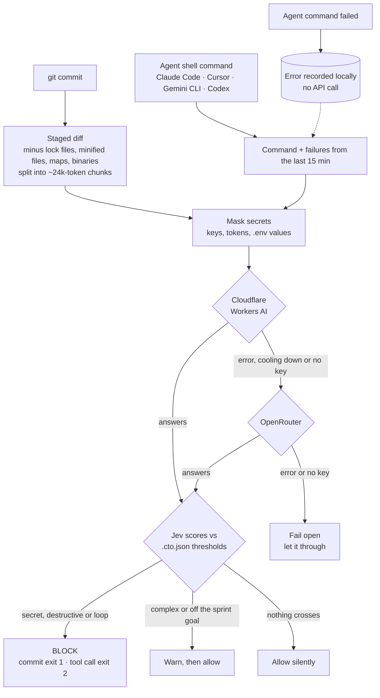

# your-cto-jev

**A sharp-tongued CTO that reviews what your AI coding agent is about to do, and says no.**

`cto` hooks into `git commit` and into the shell tool of Claude Code, Cursor, Gemini CLI and Codex. Before a commit lands or a command runs, it asks [TypeSafe Jev](https://developers.cloudflare.com/ai/models/typesafe/jev/), a typed decision model, a few yes/no questions. Then it blocks, warns, or stays completely silent.

```text
$ git commit -m "add payments"
[cto] Nice one, genius. You almost pushed a secret into Git. Commit BLOCKED. Remove it.
      credential_leak = 0.94 (threshold > 0.5)

# Claude Code tries: rm -rf ~
[cto] Hold it. This command is irreversibly destructive. Not running it.
      destructive_command = 0.96 (threshold > 0.7)

# Same build fails twice, agent tries the exact same thing again
[cto] Same error again. You are looping and burning tokens. This tool call is BLOCKED. Fix the logic first.
      infinite_loop = 0.95 (threshold > 0.85)
```

Messages come in English or 繁體中文, picked from your locale.

## Why

Coding agents move fast and occasionally do something you would never approve: commit an API key, `rm -rf` the wrong directory, force-push over a shared branch, or retry the same failing command until your token budget is gone. Regex scanners catch some of this, but they cannot tell a real key from a placeholder, or a cleanup from a disaster.

Jev judges meaning and answers with probabilities, not prose. It costs about $0.00002 per check and answered in about 250 ms (p95 about 330 ms) in our tests. `cto` adds the hooks, the thresholds and the attitude.

## What it checks

| Signal | Where | What happens |
|---|---|---|
| `credential_leak` | every `git commit` | **Blocks** the commit |
| `destructive_command` | every agent shell command | **Blocks** the command |
| `infinite_loop` | agent shell commands, after a recent failure | **Blocks** the command |
| `architecture_violation` | `git commit`, once you set a sprint goal | Warns only |
| `code_complexity` | every `git commit` | Warns only |

Architecture and complexity only warn on purpose. They are subjective, and a gate that blocks too often teaches people to use `git commit --no-verify`, which switches off the secret check too.

When nothing crosses a threshold, `cto` prints nothing at all.

## How it works



A provider that fails is skipped for 5 minutes after a timeout, `429` or `5xx`, or for 1 hour after an auth or billing error, then retried. A `400` means the request itself is wrong, so `cto` fails open without trying the other provider.

## Quick start

Requires Node.js 22 or newer.

```sh
npm install -g https://github.com/rainday/your-cto-jev/archive/refs/heads/main.tar.gz
cd your-project
cto setup
```

Use the tarball URL rather than `github:rainday/your-cto-jev`. For global installs from a git URL, npm on Windows links the package to a temporary clone it later deletes, which leaves `cto` broken. Run the same command again to update.

`cto setup` walks you through it in the terminal:

```text
Which coding agents should get command interception?
  Claude Code (detected) [Y/n]
  Cursor (detected) [Y/n]
  Gemini CLI [y/N]
  Codex CLI (detected) [Y/n]

Set up a Jev API key (at least one; press Enter to skip).
  OpenRouter API key: ********
  Verifying OpenRouter with one real request...
  OpenRouter OK
```

Then restart your agent session so it picks up the new hooks.

Other forms:

```sh
cto setup --agents claude,cursor --yes   # non-interactive (scripts, CI)
cto setup --keys                         # change keys later
cto setup --uninstall                    # remove every cto hook again
```

`setup` appends marked blocks and merges JSON. It never overwrites your existing hooks or settings, and `--uninstall` puts them back exactly as they were. It never touches your shell rc files.

## Supported agents

The git pre-commit check is always installed. It protects every agent and every human who commits from that repo.

| Agent | Config written | Command gate | Loop detection |
|---|---|---|---|
| Claude Code | `.claude/settings.local.json` | yes | yes |
| Cursor | `.cursor/hooks.json` | yes | yes |
| Gemini CLI | `.gemini/settings.json` | yes | yes |
| Codex CLI | `.codex/hooks.json` | yes | limited: Codex has no failure event |

Claude Code is tested end to end inside the agent. The Cursor, Gemini CLI and Codex adapters follow each agent's official hook docs and are tested with their documented payloads, but have not been run inside those agents yet. Reports welcome.

Codex only runs project hooks after you trust the project. Teammates who have not installed `cto` are never blocked: the git hook checks for `cto` first, and Claude Code, Cursor and Gemini CLI document a failed hook command (other than exit 2) as non-blocking.

## API keys

You need at least one provider:

| Provider | Keys | Notes |
|---|---|---|
| [OpenRouter](https://openrouter.ai) | `OPENROUTER_API_KEY` | Easiest way to start |
| [Cloudflare Workers AI](https://developers.cloudflare.com/ai/models/typesafe/jev/) | `CLOUDFLARE_API_TOKEN`, `CLOUDFLARE_ACCOUNT_ID` | Tried first when set. Your account's default AI Gateway must have **Authenticated Gateway** on and Unified Billing credits, or every call returns `403` |

If the first provider fails, `cto` switches to the next one and tells you once. It retries the first provider later. A missing key, a timeout or an outage never blocks you: `cto` fails open and lets the action through. It only blocks when Jev answers and the answer crosses a threshold.

**Where keys live.** Environment variables win. Otherwise `cto` reads a per-user file that `setup` writes:

- Windows: `%APPDATA%\your-cto-jev\credentials.json`
- macOS and Linux: `~/.config/your-cto-jev/credentials.json` (mode 600)

The file sits outside every repository, so it cannot be committed. It exists because agents and git clients started from a GUI often never see variables exported in `.zshrc`, and the hook would silently let everything through.

## What leaves your machine

Every check sends text to your chosen provider. `cto` masks it first:

- **For commits:** the staged diff, with lock files, minified files, source maps and binaries removed.
- **For agent commands:** the command, plus up to five failures from the last 15 minutes when checking for loops.
- **Always masked:** private key blocks, Stripe, OpenAI, AWS, GitHub and npm tokens, and any `NAME=value` whose name ends in `PASSWORD`, `SECRET`, `TOKEN` or `KEY`. Every value in a `.env` file is masked as well.

Masking only controls what goes out. Jev still sees labels such as `[REDACTED: STRIPE_KEY]`, which is how it knows a real secret was there.

Nothing else is uploaded, and nothing is logged unless you set `CTO_DEBUG=1`. That writes the masked input to `debug_stdin.json`, which `setup` adds to `.gitignore`.

## Configuration

`.cto.json` is shared with the team, so commit it:

```json
{
  "sprint_goal": "",
  "thresholds": {
    "credential_leak": 0.5,
    "destructive_command": 0.7,
    "infinite_loop": 0.85,
    "architecture_violation": 0.85,
    "code_complexity": 2
  }
}
```

- **`sprint_goal`**: fill it in to enable the architecture check, for example `"Ship Stripe billing, no new services"`.
- **Thresholds**: Jev returns a probability from 0 to 1. `code_complexity` is the exception: it is a score from 0 (clean) to 4 (unmaintainable).
- **Calibration**: in our tests `git push --force` scored about 0.50 for `destructive_command`, so the default lets it through. Lower that threshold to about 0.45 if you want force pushes blocked.

`.cto-brain.json` holds personal runtime state and is gitignored.

| Env var | Purpose |
|---|---|
| `CTO_PROVIDER` | Use only `cloudflare` or only `openrouter` |
| `CTO_FAILOVER=0` | Never switch providers |
| `CTO_LANG` | `en` or `zh-TW` (default: your locale) |
| `CTO_DEBUG=1` | Write masked hook input to `debug_stdin.json` |

## Known limitations

- **Git GUIs hide warnings.** VS Code, SourceTree and GitKraken usually hide hook output when the commit succeeds, so the architecture and complexity warnings are invisible there. Blocks still show.
- **A retry after a fix can look like a loop.** The loop check sees recent failures but not the edits you made since. Failures expire after 15 minutes. Raise `infinite_loop` if it gets in your way.
- **Each agent shell command waits about half a second** for Node startup plus one Jev request.

## Development

```sh
git clone https://github.com/rainday/your-cto-jev
cd your-cto-jev
npm install
npm test
```

The full design, including the measured results behind the defaults, is in [`your-cto-jev-spec.html`](./your-cto-jev-spec.html) (written in 繁體中文).

## License

[MIT](./LICENSE)
